## These are the base input images 

<!-- link all the images from s7_explainability/s7/ImageNet_10_Images/ to this readme file-->

1. image 1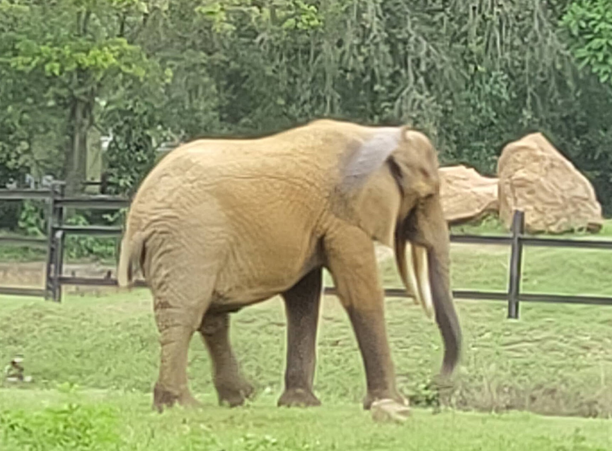
2. image 2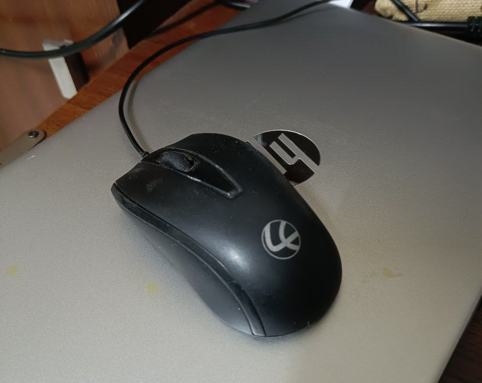
3. image 3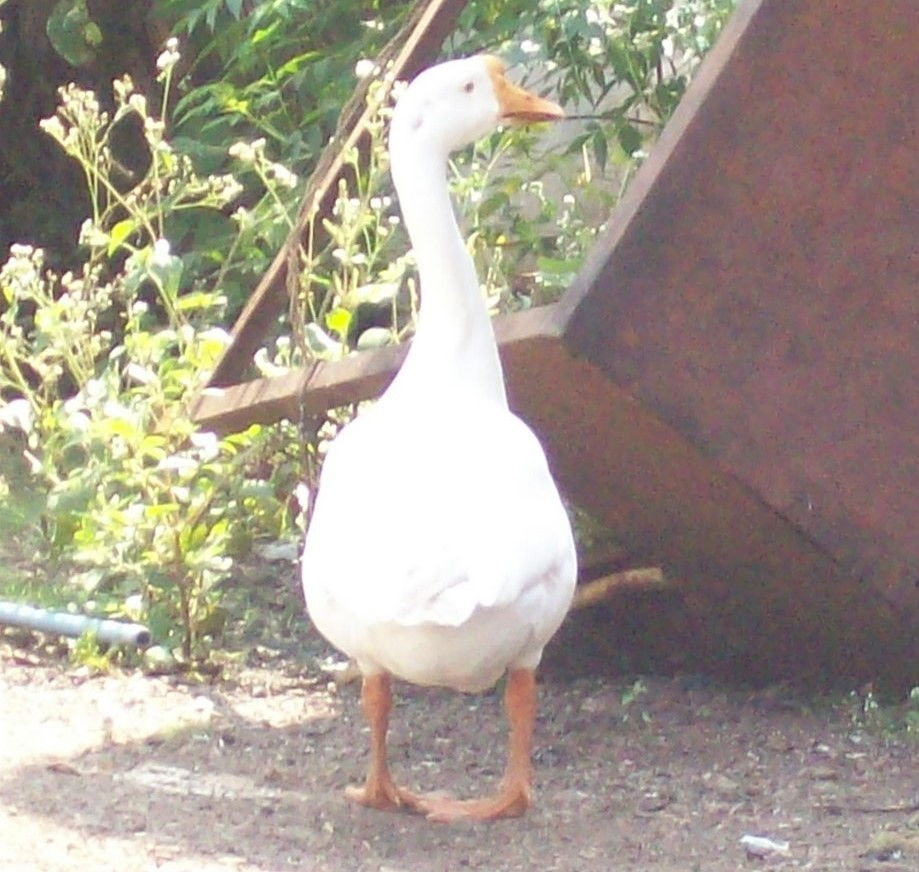
4. image 4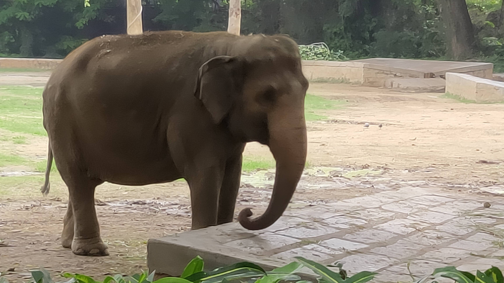
5. image 5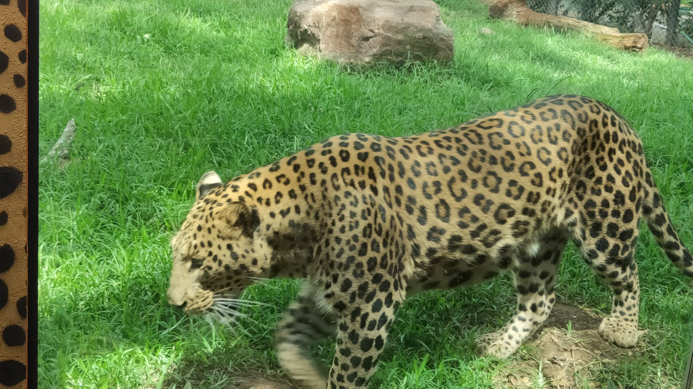
6. image 6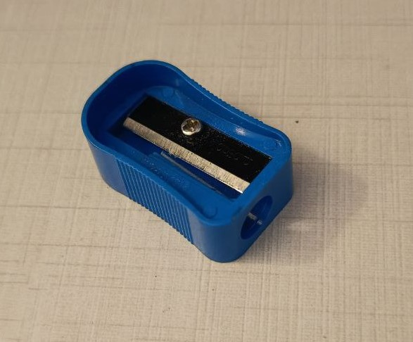
7. image 7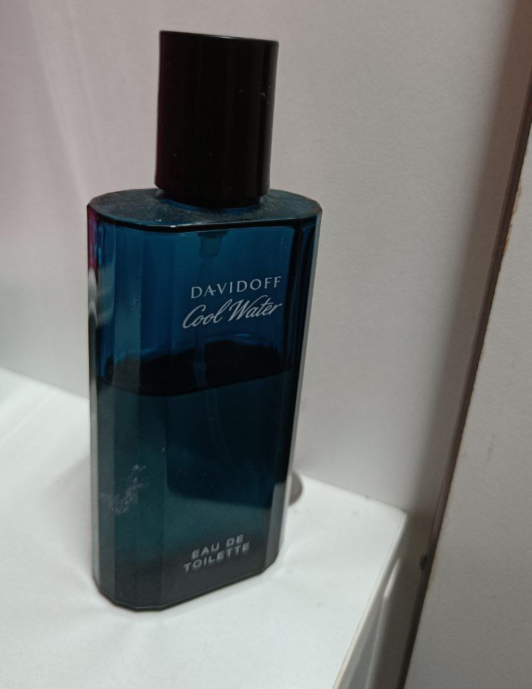
8. image 8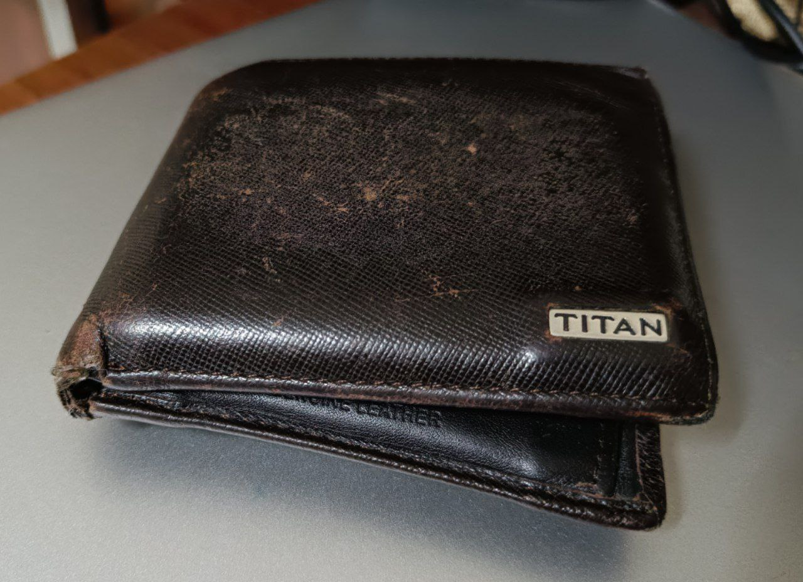
9. image 9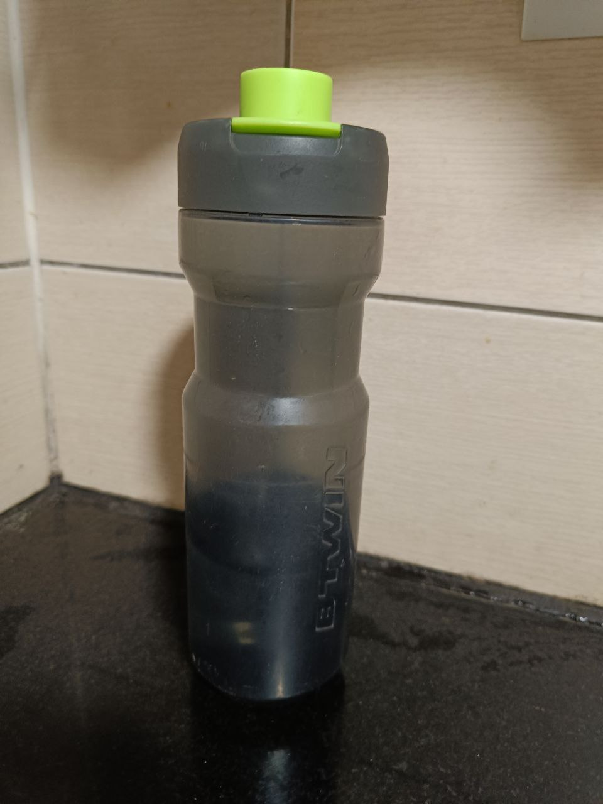
10. image 10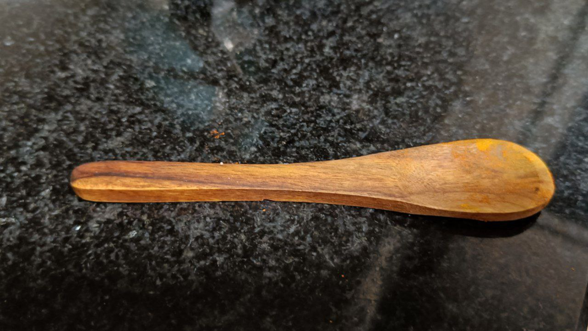

## These are images with explanations

<!-- ['African_Elephant_386_gradcam.jpg',
 'African_Elephant_386_gradcam_plus_plus.jpg',
 'African_Elephant_386_ig.jpg',
 'African_Elephant_386_ig_with_noisetunnel.jpg',
 'African_Elephant_386_occlusion.jpg',
 'African_Elephant_386_saliency.jpg',
 'African_Elephant_386_shap.jpg',
 'Computer_Mouse_673_gradcam.jpg',
 'Computer_Mouse_673_gradcam_plus_plus.jpg',
 'Computer_Mouse_673_ig.jpg',
 'Computer_Mouse_673_ig_with_noisetunnel.jpg',
 'Computer_Mouse_673_occlusion.jpg',
 'Computer_Mouse_673_saliency.jpg',
 'Computer_Mouse_673_shap.jpg',
 'Goose_99_gradcam.jpg',
 'Goose_99_gradcam_plus_plus.jpg',
 'Goose_99_ig.jpg',
 'Goose_99_ig_with_noisetunnel.jpg',
 'Goose_99_occlusion.jpg',
 'Goose_99_saliency.jpg',
 'Goose_99_shap.jpg',
 'Indian_Elephant_385_gradcam.jpg',
 'Indian_Elephant_385_gradcam_plus_plus.jpg',
 'Indian_Elephant_385_ig.jpg',
 'Indian_Elephant_385_ig_with_noisetunnel.jpg',
 'Indian_Elephant_385_occlusion.jpg',
 'Indian_Elephant_385_saliency.jpg',
 'Indian_Elephant_385_shap.jpg',
 'Leopard_288_gradcam.jpg',
 'Leopard_288_gradcam_plus_plus.jpg',
 'Leopard_288_ig.jpg',
 'Leopard_288_ig_with_noisetunnel.jpg',
 'Leopard_288_occlusion.jpg',
 'Leopard_288_saliency.jpg',
 'Leopard_288_shap.jpg',
 'Pencil_Sharpener_710_gradcam.jpg',
 'Pencil_Sharpener_710_gradcam_plus_plus.jpg',
 'Pencil_Sharpener_710_ig.jpg',
 'Pencil_Sharpener_710_ig_with_noisetunnel.jpg',
 'Pencil_Sharpener_710_occlusion.jpg',
 'Pencil_Sharpener_710_saliency.jpg',
 'Pencil_Sharpener_710_shap.jpg',
 'Perfume_711_gradcam.jpg',
 'Perfume_711_gradcam_plus_plus.jpg',
 'Perfume_711_ig.jpg',
 'Perfume_711_ig_with_noisetunnel.jpg',
 'Perfume_711_occlusion.jpg',
 'Perfume_711_saliency.jpg',
 'Perfume_711_shap.jpg',
 'Wallet_893_gradcam.jpg',
 'Wallet_893_gradcam_plus_plus.jpg',
 'Wallet_893_ig.jpg',
 'Wallet_893_ig_with_noisetunnel.jpg',
 'Wallet_893_occlusion.jpg',
 'Wallet_893_saliency.jpg',
 'Wallet_893_shap.jpg',
 'water_bottle_898_gradcam.jpg',
 'water_bottle_898_gradcam_plus_plus.jpg',
 'water_bottle_898_ig.jpg',
 'water_bottle_898_ig_with_noisetunnel.jpg',
 'water_bottle_898_occlusion.jpg',
 'water_bottle_898_saliency.jpg',
 'water_bottle_898_shap.jpg',
 'wooden_spoon_910_gradcam.jpg',
 'wooden_spoon_910_gradcam_plus_plus.jpg',
 'wooden_spoon_910_ig.jpg',
 'wooden_spoon_910_ig_with_noisetunnel.jpg',
 'wooden_spoon_910_occlusion.jpg',
 'wooden_spoon_910_saliency.jpg',
 'wooden_spoon_910_shap.jpg'] -->

<!-- ['African_Elephant_386_fgsm.jpg',
 'African_Elephant_386_Gaussnoise.jpg',
 'African_Elephant_386_pixeldropout_.jpg',
 'African_Elephant_386_RandomBrightness.jpg',
 'Computer_Mouse_673_fgsm.jpg',
 'Computer_Mouse_673_Gaussnoise.jpg',
 'Computer_Mouse_673_pixeldropout_.jpg',
 'Computer_Mouse_673_RandomBrightness.jpg',
 'Goose_99_fgsm.jpg',
 'Goose_99_Gaussnoise.jpg',
 'Goose_99_pixeldropout_.jpg',
 'Goose_99_RandomBrightness.jpg',
 'Indian_Elephant_385_fgsm.jpg',
 'Indian_Elephant_385_Gaussnoise.jpg',
 'Indian_Elephant_385_pixeldropout_.jpg',
 'Indian_Elephant_385_RandomBrightness.jpg',
 'Leopard_288_fgsm.jpg',
 'Leopard_288_Gaussnoise.jpg',
 'Leopard_288_pixeldropout_.jpg',
 'Leopard_288_RandomBrightness.jpg',
 'Pencil_Sharpener_710_fgsm.jpg',
 'Pencil_Sharpener_710_Gaussnoise.jpg',
 'Pencil_Sharpener_710_pixeldropout_.jpg',
 'Pencil_Sharpener_710_RandomBrightness.jpg',
 'Perfume_711_fgsm.jpg',
 'Perfume_711_Gaussnoise.jpg',
 'Perfume_711_pixeldropout_.jpg',
 'Perfume_711_RandomBrightness.jpg',
 'Wallet_893_fgsm.jpg',
 'Wallet_893_Gaussnoise.jpg',
 'Wallet_893_pixeldropout_.jpg',
 'Wallet_893_RandomBrightness.jpg',
 'water_bottle_898_fgsm.jpg',
 'water_bottle_898_Gaussnoise.jpg',
 'water_bottle_898_pixeldropout_.jpg',
 'water_bottle_898_RandomBrightness.jpg',
 'wooden_spoon_910_fgsm.jpg',
 'wooden_spoon_910_Gaussnoise.jpg',
 'wooden_spoon_910_pixeldropout_.jpg',
 'wooden_spoon_910_RandomBrightness.jpg'] -->

 ## image 1 Explanations

 
 ### ig
 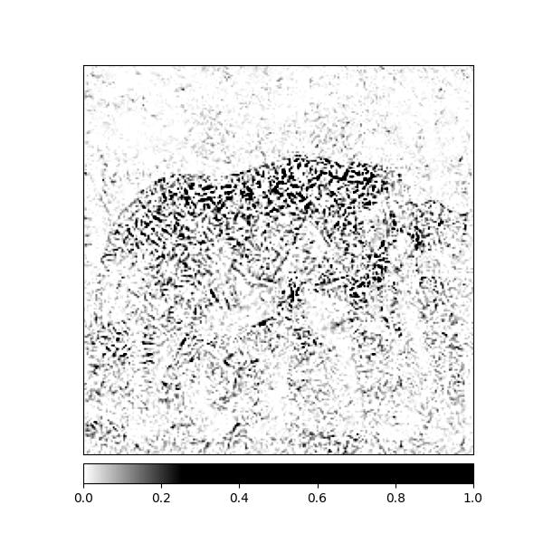
 
 ### shap
 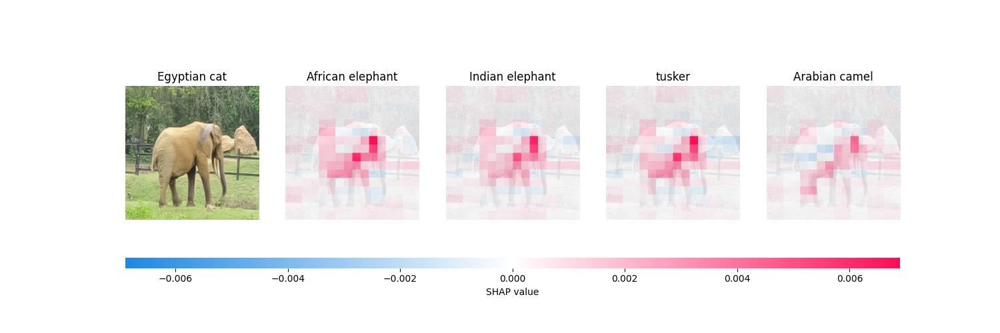

  ### occlusion
 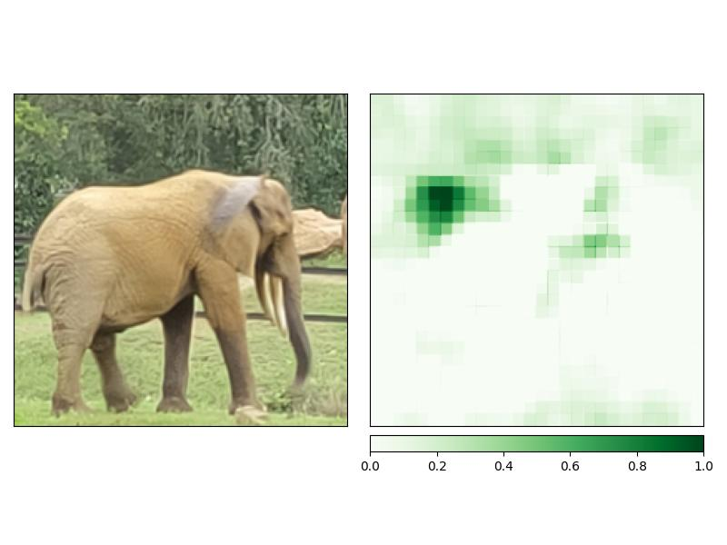
 
 
  ###  Gradcam_plus_plus
 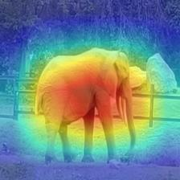
 
 
  ###  Saliency
 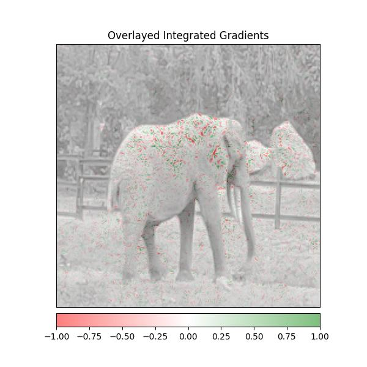
 
 
 ###  Ig_with_noisetunnel
 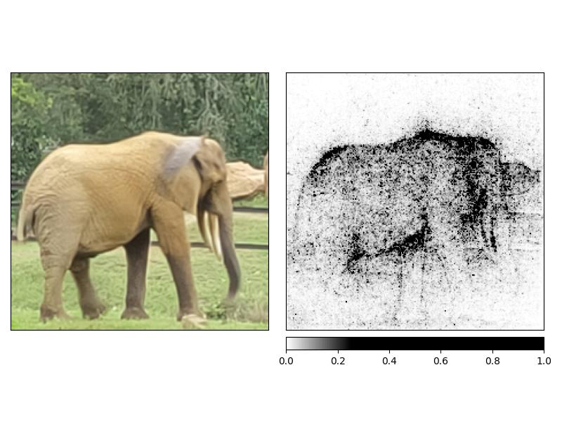
 
 ###  Gradcam
 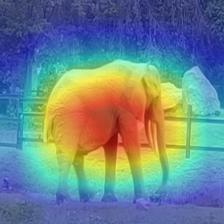
 
 ### All the explanations for other remaining images can be found on the folder namely s7_explainability/s7/output_explainability
 
 

## PGD image transformations

<!-- ['African_Elephant_386_pgd.jpg',
 'Computer_Mouse_673_pgd.jpg',
 'Goose_99_pgd.jpg',
 'Indian_Elephant_385_pgd.jpg',
 'Leopard_288_pgd.jpg',
 'Pencil_Sharpener_710_pgd.jpg',
 'Perfume_711_pgd.jpg',
 'Wallet_893_pgd.jpg',
 'water_bottle_898_pgd.jpg',
 'wooden_spoon_910_pgd.jpg'] -->

image_1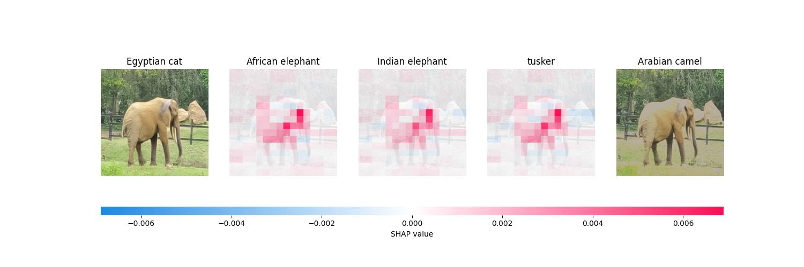
image_2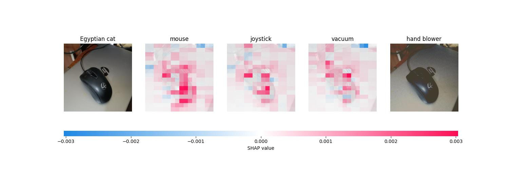
image_3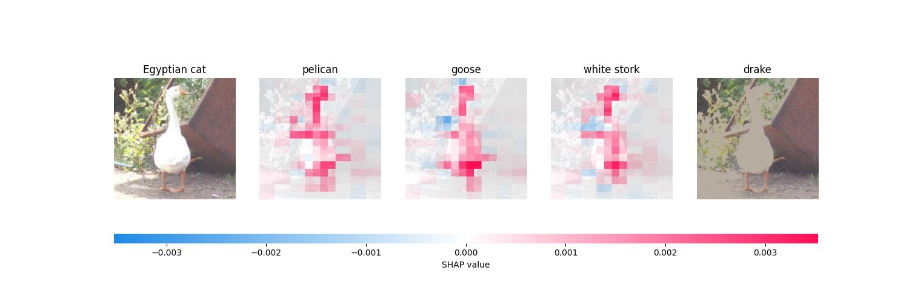
image_4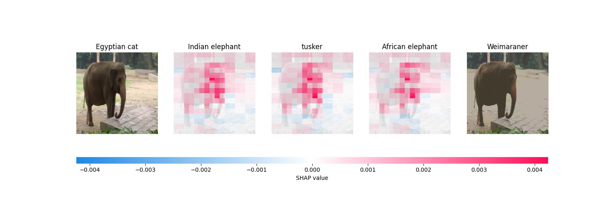
image_5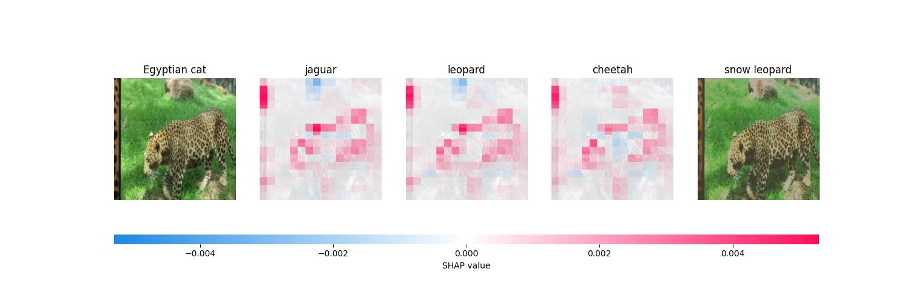
image_6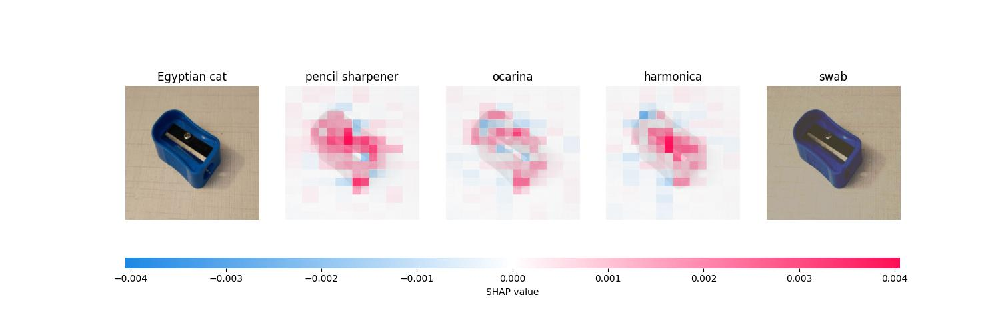
image_7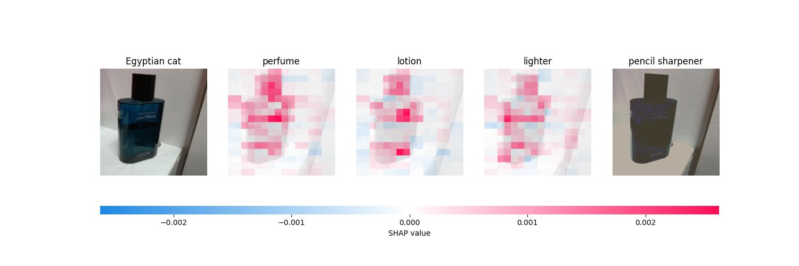
image_8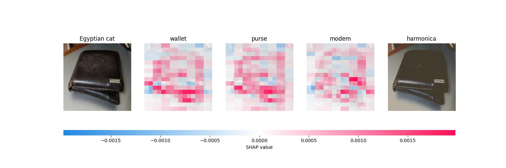
image_9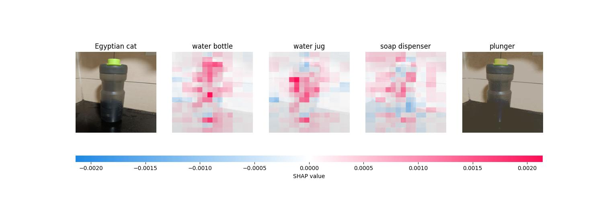
image_10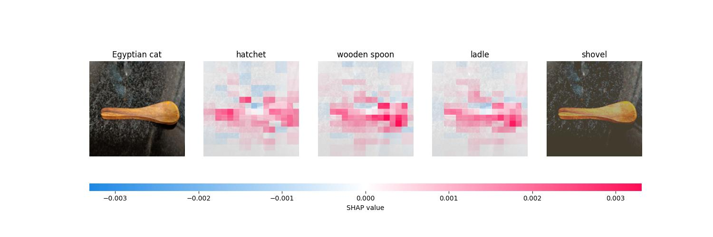

## Model Robustness

<!-- ['African_Elephant_386_fgsm.jpg',
 'African_Elephant_386_Gaussnoise.jpg',
 'African_Elephant_386_pixeldropout_.jpg',
 'African_Elephant_386_RandomBrightness.jpg',
 'Computer_Mouse_673_fgsm.jpg',
 'Computer_Mouse_673_Gaussnoise.jpg',
 'Computer_Mouse_673_pixeldropout_.jpg',
 'Computer_Mouse_673_RandomBrightness.jpg',
 'Goose_99_fgsm.jpg',
 'Goose_99_Gaussnoise.jpg',
 'Goose_99_pixeldropout_.jpg',
 'Goose_99_RandomBrightness.jpg',
 'Indian_Elephant_385_fgsm.jpg',
 'Indian_Elephant_385_Gaussnoise.jpg',
 'Indian_Elephant_385_pixeldropout_.jpg',
 'Indian_Elephant_385_RandomBrightness.jpg',
 'Leopard_288_fgsm.jpg',
 'Leopard_288_Gaussnoise.jpg',
 'Leopard_288_pixeldropout_.jpg',
 'Leopard_288_RandomBrightness.jpg',
 'Pencil_Sharpener_710_fgsm.jpg',
 'Pencil_Sharpener_710_Gaussnoise.jpg',
 'Pencil_Sharpener_710_pixeldropout_.jpg',
 'Pencil_Sharpener_710_RandomBrightness.jpg',
 'Perfume_711_fgsm.jpg',
 'Perfume_711_Gaussnoise.jpg',
 'Perfume_711_pixeldropout_.jpg',
 'Perfume_711_RandomBrightness.jpg',
 'Wallet_893_fgsm.jpg',
 'Wallet_893_Gaussnoise.jpg',
 'Wallet_893_pixeldropout_.jpg',
 'Wallet_893_RandomBrightness.jpg',
 'water_bottle_898_fgsm.jpg',
 'water_bottle_898_Gaussnoise.jpg',
 'water_bottle_898_pixeldropout_.jpg',
 'water_bottle_898_RandomBrightness.jpg',
 'wooden_spoon_910_fgsm.jpg',
 'wooden_spoon_910_Gaussnoise.jpg',
 'wooden_spoon_910_pixeldropout_.jpg',
 'wooden_spoon_910_RandomBrightness.jpg'] -->

 ## image 1 Robustness check with Different techniques

 
 ### fgsm
 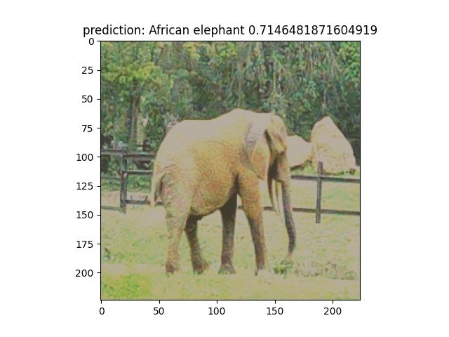
 
 ### Gaussnoise
 

  ### pixeldropout
 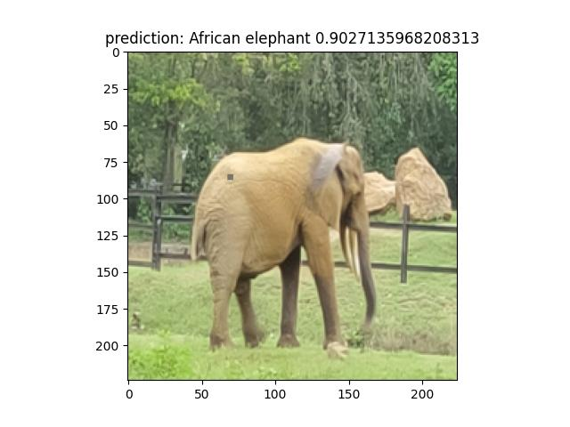
 
 
  ### RandomBrightness
 
 
 ### All the Model Robustness checks  for other remaining images can be found on the folder namely s7_explainability/s7/Robustness_output
 

